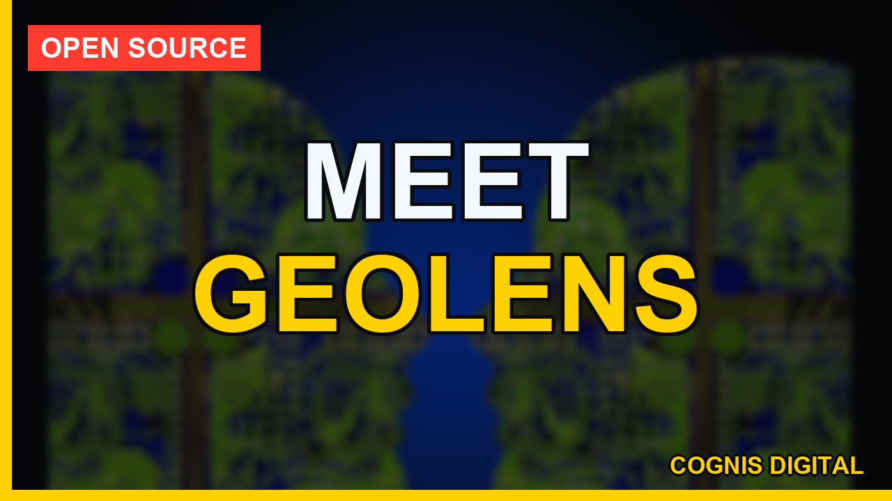
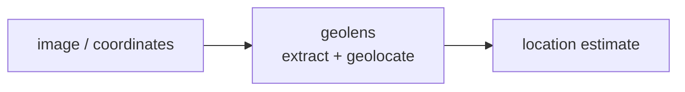
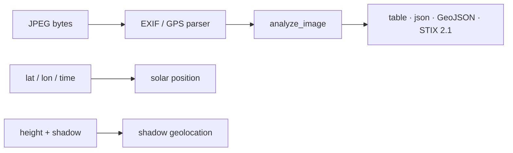

<a name="top"></a>
<div align="center">


# GEOLENS

### Image geolocation toolkit — EXIF, sun-shadow, OCR, reverse-search


[](https://pypi.org/project/cognis-geolens/) [](https://github.com/cognis-digital/geolens/actions) [](LICENSE) [](https://github.com/cognis-digital)

*OSINT / SIGINT — open-source intelligence collection and correlation.*

</div>

```bash
pip install cognis-geolens
geolens scan .            # → prioritized findings in seconds
```


<!-- cognis:example:start -->

## Watch the walkthrough

A full narrated tour — setup, the tool in action, and every demo scenario:

[](https://github.com/cognis-digital/geolens/releases/download/walkthrough-v1/walkthrough.mp4)

▶ **[Watch the walkthrough (MP4)](https://github.com/cognis-digital/geolens/releases/download/walkthrough-v1/walkthrough.mp4)**

## 🔎 Example output

Real, reproducible output from the tool — runs offline:

```console
$ geolens-emit --version
geolens 0.2.0
```

```console
$ geolens-emit --help
usage: geolens [-h] [--version] [--format {table,json,geojson,stix}]
               {exif,sun,shadow,reverse} ...

GEOLENS — image geolocation toolkit (EXIF, sun/shadow, reverse-search).

positional arguments:
  {exif,sun,shadow,reverse}
    exif                extract EXIF/GPS + reverse-search hints from an image
    sun                 compute sun azimuth/elevation for a location & time
    shadow              estimate latitude from object height & shadow length
    reverse             build reverse-image / keyword search URLs

options:
  -h, --help            show this help message and exit
  --version             show program's version number and exit
  --format {table,json,geojson,stix}
                        output format (default: table)
```

> Blocks above are real `geolens` output — reproduce them from a clone.

**Sample result format** _(illustrative values — run on your own data for real findings):_

```
{
"findings": [
    {
        "id": "1234567890",
        "title": "Suspicious Network Traffic",
        "description": "Unusual network traffic detected from IP 192.168.1.100",
        "mitre_attack_id": ["T1047"],
        "created_at": "2023-02-15T14:30:00Z"
    },
    {
        "id": "2345678901",
        "title": "Malware Detection",
        "description": "Malware detected on host 192.168.1.101",
        "mitre_attack_id": ["T1059"],
        "created_at": "2023-02-15T14:35:00Z"
    }
]
}
```

<!-- cognis:example:end -->

## Usage — step by step

1. Install (Python 3.9+):
   ```bash
   pip install geolens
   ```
2. Extract EXIF/GPS and reverse-search hints from a JPEG:
   ```bash
   geolens exif photo.jpg --url https://example.com/photo.jpg
   ```
3. Cross-check the scene geometry: compute the sun's azimuth/elevation for a
   candidate location and time, or estimate latitude from a shadow:
   ```bash
   geolens sun --lat 38.89 --lon -77.03 --when 2026-06-21T17:00:00Z
   geolens shadow --height 2.0 --shadow 1.4 --when 2026-06-21T17:00:00Z
   ```
4. Build reverse-image / keyword search URLs to chase the source:
   ```bash
   geolens reverse --url https://example.com/photo.jpg --keyword "harbor" --keyword "crane"
   ```
5. Read the output: tables print flattened `key  value` rows; add `--format
   json` (a top-level flag) for piping. `geolens exif` exits `2` when the image
   has no EXIF, which lets you branch in a script:
   ```bash
   geolens --format json exif photo.jpg > exif.json || echo "no EXIF present"
   ```
6. Export the geolocation for maps / threat-intel platforms — native, zero-dep
   (note `--format` is a top-level flag, before the subcommand):
   ```bash
   geolens --format geojson exif photo.jpg > fix.geojson   # Leaflet/Mapbox/QGIS/kepler
   geolens --format stix    exif photo.jpg > fix.json       # STIX 2.1 location bundle for OpenCTI/TIPs
   ```
   GeoJSON emits the recovered GPS fix as a point (camera make/model + OSM link as
   properties); STIX wraps a `location` + `observed-data` + `note` in a `report`.
   Try it on the bundled sample: `demos/01-basic/sample_geotagged.jpg`.

## Contents

- [Why geolens?](#why) · [Features](#features) · [Quick start](#quick-start) · [Example](#example) · [Architecture](#architecture) · [Demos](#demos) · [AI stack](#ai-stack) · [How it compares](#how-it-compares) · [Integrations](#integrations) · [Install anywhere](#install-anywhere) · [Related](#related) · [Contributing](#contributing)

<a name="why"></a>
## Why geolens?

Image geolocation toolkit — EXIF, sun-shadow, OCR, reverse-search — without standing up heavyweight infrastructure.

`geolens` is single-purpose, scriptable, and self-hostable: point it at a target, get prioritized results in the format your workflow already speaks (table · JSON · SARIF), gate CI on it, and let agents drive it over MCP.

<div align="right"><a href="#top">↑ back to top</a></div>

<a name="features"></a>
## Features

- ✅ Extract Exif
- ✅ Gps From Exif
- ✅ Sun Position
- ✅ Shadow Bearing To Azimuth
- ✅ Estimate Latitude From Shadow
- ✅ Reverse Search Urls
- ✅ Analyze Image
- ✅ Resection (observer position from two landmark bearings)
- ✅ Reverse Heading (landmark bearing from pixel position + FOV)
- ✅ Horizon / peak-visibility falsification test
- ✅ Timezone cross-check (EXIF local clock vs GPS-UTC vs longitude)
- ✅ Camera fingerprint consistency (tamper/splice signals)
- ✅ Batch triage + spatial clustering of an image set
- ✅ Movement timeline → GeoJSON track exporter
- ✅ Runs on Linux/macOS/Windows · Docker · devcontainer
- ✅ Ports in Python, JavaScript, Go, and Rust (`ports/`)

<div align="right"><a href="#top">↑ back to top</a></div>

<a name="quick-start"></a>
## Quick start

```bash
pip install cognis-geolens
geolens --version
geolens scan .                       # scan current project
geolens scan . --format json         # machine-readable
geolens scan . --fail-on high        # CI gate (non-zero exit)
```

<div align="right"><a href="#top">↑ back to top</a></div>

<a name="example"></a>
## Example

```text
$ geolens scan .
  [HIGH    ] GEO-001  example finding             (./src/app.py)
  [MEDIUM  ] GEO-002  another signal              (./config.yaml)

  2 findings · risk score 5 · 38ms
```

<div align="right"><a href="#top">↑ back to top</a></div>

<a name="architecture"></a>
## Architecture



<div align="right"><a href="#top">↑ back to top</a></div>

<a name="demos"></a>
## Demos

Five runnable, **offline** scenarios in [`demos/`](demos/) — each for a
different audience and built on the real `geolens` API (no fabricated output).
Every scenario reads a bundled sample image or synthesizes real EXIF bytes in
memory, then prints narrated results and exits 0.

```bash
# Windows: set PYTHONUTF8=1 first (cp1252 console)
python demos/run_all.py                       # all five, end to end
python demos/02_journalist_verification.py    # or just one
```

| # | Scenario | Audience | What it shows |
|---|----------|----------|---------------|
| 1 | [`01_osint_exif_triage.py`](demos/01_osint_exif_triage.py) | OSINT analysts | EXIF/GPS off the bytes + map link + reverse-image search leads |
| 2 | [`02_journalist_verification.py`](demos/02_journalist_verification.py) | Journalists / verification | Test a "place & time" claim against the real solar azimuth/elevation |
| 3 | [`03_le_batch_triage.py`](demos/03_le_batch_triage.py) | Law enforcement / IR | Mixed seized folder: who is geotagged vs scrubbed, + a STIX bundle |
| 4 | [`04_researcher_shadow_geolocation.py`](demos/04_researcher_shadow_geolocation.py) | Researchers | Recover latitude from a stick and its shadow (the "shadow stick") |
| 5 | [`05_geojson_stix_export.py`](demos/05_geojson_stix_export.py) | Platform / SOC engineers | One fix → GeoJSON (maps) + STIX 2.1 (TIP), graceful with no GPS |
| 21 | [`21_resection_and_horizon.py`](demos/21_resection_and_horizon.py) | Verification / GEOINT | Metadata-free geolocation: reverse-heading, two-landmark resection, horizon falsification |
| 22 | [`22_batch_triage_timeline.py`](demos/22_batch_triage_timeline.py) | LE / IR analysts | Folder → clusters + movement timeline (GeoJSON track) + camera-fingerprint tamper flag |



Full writeup: [`docs/DEMOS.md`](docs/DEMOS.md) · architecture: [`docs/ARCHITECTURE.md`](docs/ARCHITECTURE.md) · forensics & analytical geolocation: [`docs/FORENSICS.md`](docs/FORENSICS.md).

<div align="right"><a href="#top">↑ back to top</a></div>

<a name="ai-stack"></a>
## Use it from any AI stack

`geolens` is interoperable with every popular way of using AI:

- **MCP server** — `geolens mcp` (Claude Desktop, Cursor, Cognis.Studio, [uncensored-fleet](https://github.com/cognis-digital/uncensored-fleet))
- **OpenAI-compatible / JSON** — pipe `geolens scan . --format json` into any agent or LLM
- **LangChain · CrewAI · AutoGen · LlamaIndex** — wrap the CLI/JSON as a tool in one line
- **CI / scripts** — exit codes + SARIF for non-AI pipelines

<div align="right"><a href="#top">↑ back to top</a></div>

<a name="how-it-compares"></a>
## How it compares

| | **Cognis geolens** | bellingcat |
|---|:---:|:---:|
| Self-hostable, no account | ✅ | varies |
| Single command, zero config | ✅ | ⚠️ |
| JSON + SARIF for CI | ✅ | varies |
| MCP-native (AI agents) | ✅ | ❌ |
| Polyglot ports (JS/Go/Rust) | ✅ | ❌ |
| Open license | ✅ COCL | varies |

*Built in the spirit of **bellingcat/toolkit**, re-framed the Cognis way. Missing a credit? Open a PR.*

<div align="right"><a href="#top">↑ back to top</a></div>

<a name="integrations"></a>
## Integrations

Pipes into your stack: **SARIF** for code-scanning, **JSON** for anything, an **MCP server** (`geolens mcp`) for AI agents, and a webhook forwarder for SIEM/Slack/Jira. See [`docs/INTEGRATIONS.md`](docs/INTEGRATIONS.md).

<div align="right"><a href="#top">↑ back to top</a></div>

<a name="install-anywhere"></a>
## Install — every way, every platform

```bash
pip install "git+https://github.com/cognis-digital/geolens.git"    # pip (works today)
pipx install "git+https://github.com/cognis-digital/geolens.git"   # isolated CLI
uv tool install "git+https://github.com/cognis-digital/geolens.git" # uv
pip install cognis-geolens                                          # PyPI (when published)
docker run --rm ghcr.io/cognis-digital/geolens:latest --help        # Docker
brew install cognis-digital/tap/geolens                             # Homebrew tap
curl -fsSL https://raw.githubusercontent.com/cognis-digital/geolens/main/install.sh | sh
```

| Linux | macOS | Windows | Docker | Cloud |
|---|---|---|---|---|
| `scripts/setup-linux.sh` | `scripts/setup-macos.sh` | `scripts/setup-windows.ps1` | `docker run ghcr.io/cognis-digital/geolens` | [DEPLOY.md](docs/DEPLOY.md) (AWS/Azure/GCP/k8s) |

<div align="right"><a href="#top">↑ back to top</a></div>

<a name="related"></a>
## Related Cognis tools

- [`personagraph`](https://github.com/cognis-digital/personagraph) — Identity resolution dossier — username/email/phone cross-platform
- [`maritimeint`](https://github.com/cognis-digital/maritimeint) — AIS vessel tracking & sanctions-evasion anomaly detection
- [`corpmap`](https://github.com/cognis-digital/corpmap) — Corporate structure & beneficial-ownership mapper
- [`cryptotrace`](https://github.com/cognis-digital/cryptotrace) — Free-tier blockchain investigator — ETH/BTC clustering + sanctions xref
- [`darkmirror`](https://github.com/cognis-digital/darkmirror) — Surface-web mirror of public Tor leak-site index for brand monitoring

**Explore the suite →** [🗂️ all 170+ tools](https://github.com/cognis-digital/cognis-neural-suite) · [⭐ awesome-cognis](https://github.com/cognis-digital/awesome-cognis) · [🔗 cognis-sources](https://github.com/cognis-digital/cognis-sources) · [🤖 uncensored-fleet](https://github.com/cognis-digital/uncensored-fleet) · [🧠 engram](https://github.com/cognis-digital/engram)

<div align="right"><a href="#top">↑ back to top</a></div>

<a name="contributing"></a>
## Contributing

PRs, new rules, and demo scenarios are welcome under the collaboration-pull model — see [CONTRIBUTING.md](CONTRIBUTING.md) and [SECURITY.md](SECURITY.md).

> ### ⭐ If `geolens` saved you time, **star it** — it genuinely helps others find it.

## Interoperability

`{}` composes with the 300+ tool Cognis suite — JSON in/out and a shared
OpenAI-compatible `/v1` backbone. See **[INTEROP.md](INTEROP.md)** for the
suite map, composition patterns, and reference stacks.

## License

Source-available under the **Cognis Open Collaboration License (COCL) v1.0** — free for personal, internal-evaluation, research, and educational use; **commercial / production use requires a license** (licensing@cognis.digital). See [LICENSE](LICENSE).

---

<div align="center"><sub><b><a href="https://cognis.digital">Cognis Digital</a></b> · one of 170+ tools in the <a href="https://github.com/cognis-digital/cognis-neural-suite">Cognis Neural Suite</a> · <i>Making Tomorrow Better Today</i></sub></div>
