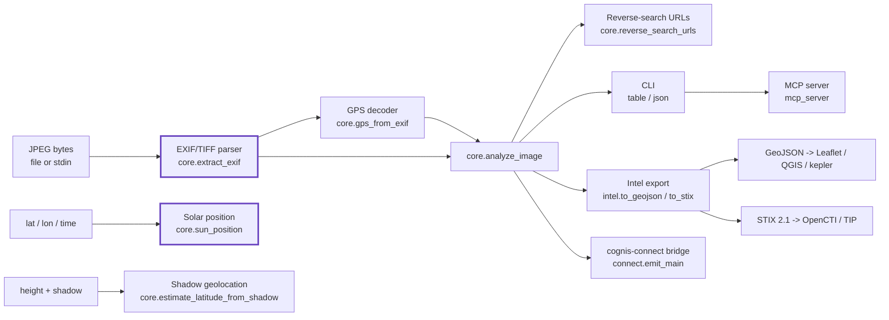
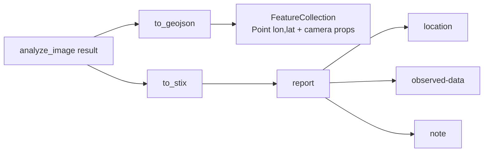

# Architecture

`geolens` is an image-geolocation toolkit that recovers *where* and *when* a
photo was taken — from the bytes alone, offline, with no upload and no cloud
dependency. It pairs a hand-written EXIF/TIFF parser with a NOAA solar-position
model, then exports the result in the formats an investigation already speaks.

## The pipeline

## Components

### EXIF / TIFF parser (`geolens/core.py`)
`extract_exif` locates the APP1 `Exif\x00\x00` segment of a JPEG, reads the TIFF
byte-order mark, and walks IFD0, the EXIF SubIFD, and the GPS IFD — decoding the
common field types (ASCII, SHORT/LONG, RATIONAL/SRATIONAL). It is a real binary
parser built on `struct`, **not** a wrapper around Pillow or exiftool. Unknown
tags are reported by numeric id so nothing is silently dropped.

### GPS decoder (`gps_from_exif`)
Converts the rational degrees/minutes/seconds GPS tags into decimal degrees,
applies the N/S and E/W reference signs, and adds altitude when present.

### Solar position (`sun_position`)
Implements the NOAA solar-position algorithm: from a UTC instant it computes the
sun's declination, equation of time, true solar time, and finally **azimuth and
elevation** for an observer at a given latitude/longitude. This is what lets a
verification desk test whether a claimed time-and-place is consistent with the
light and shadows in a frame.

### Shadow geolocation (`estimate_latitude_from_shadow`)
The Bellingcat "shadow stick" technique, inverted. At local solar noon
`tan(elevation) = height / shadow`; combined with the date's solar declination
this yields two candidate latitudes (north/south), which the shadow's compass
direction disambiguates. `shadow_bearing_to_azimuth` maps a shadow bearing to
the opposing sun azimuth.

### Analysis orchestrator (`analyze_image`)
One call: EXIF + GPS + a map link + reverse-image/keyword search URLs, surfacing
the human-relevant keys (make, model, capture time) at the top of the result.

### Intel export (`geolens/intel.py`)
Native, zero-dependency exporters that turn an `analyze_image` result into
shareable geospatial intelligence:

When no GPS is present both exporters still emit a valid (point-less) document,
so they are safe to run unconditionally in a pipeline.

### CLI (`geolens/cli.py`)
`geolens exif|sun|shadow|reverse` with a top-level `--format table|json|geojson|stix`.
`geolens exif` exits `2` when an image carries no EXIF, so scripts can branch.

### Interop bridges (`geolens/connect.py`, `geolens/mcp_server.py`)
`connect.emit_main` (the `geolens-emit` entry point) maps geolens JSON onto the
canonical cognis-connect `Finding` and forwards it to STIX/TAXII, MISP, Sigma,
Splunk, Elastic, Slack/Discord, or a webhook. `mcp_server` serves the tool to AI
agents over MCP.

## Why these choices

- **Standard library only.** No Pillow, no exiftool, no `requests`. The parser
  and the solar model are the dependencies. It runs anywhere Python 3.10 runs.
- **Offline by construction.** Nothing leaves the machine. `reverse_search_urls`
  *composes* query URLs for the analyst to open; it never fetches them.
- **Reproducible.** Every determination comes from the bytes and the math, so a
  finding can be re-derived and defended in a report.
